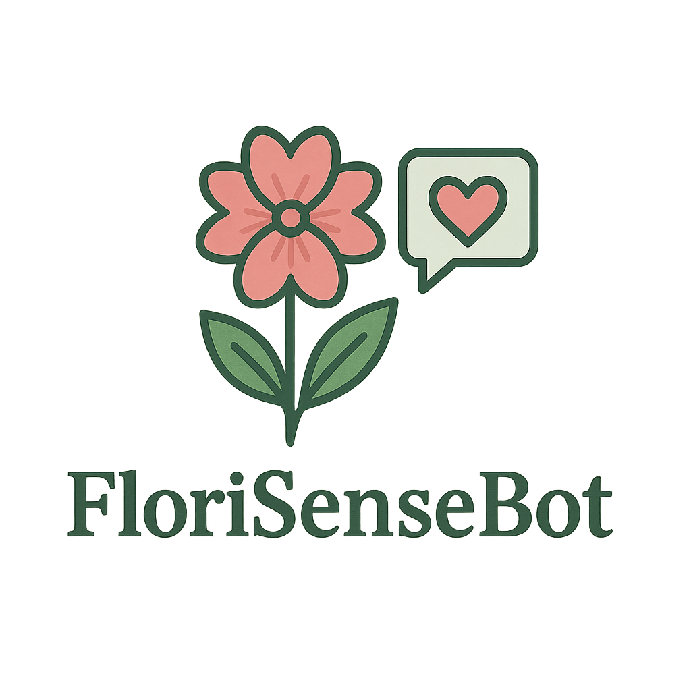
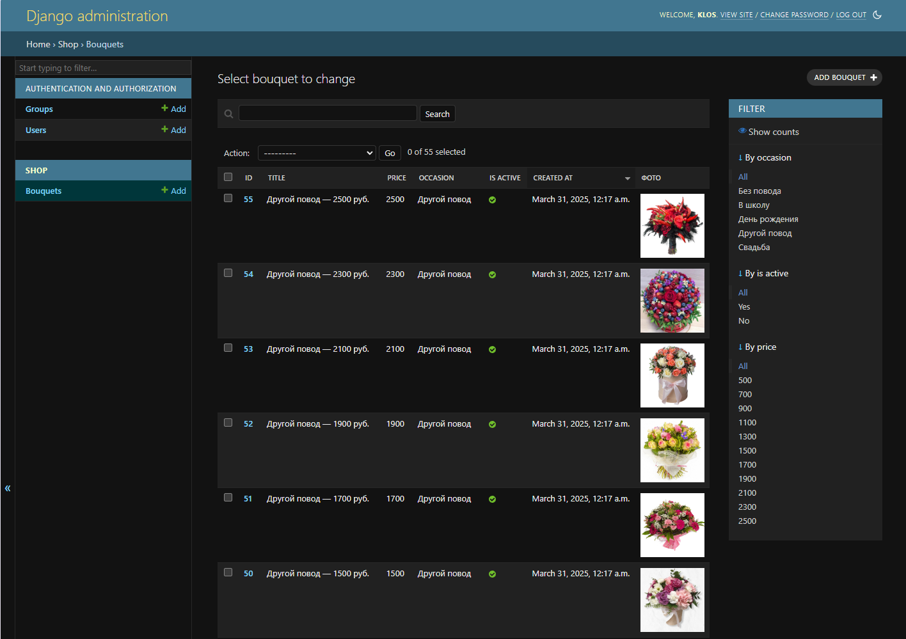
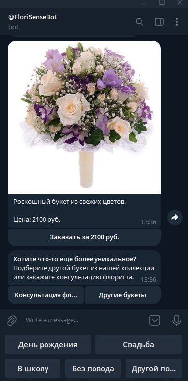

# Telegram-Бот для Цветочного Магазина


Телеграм-бот и веб-админка для заказа букетов на разные поводы. Позволяет пользователю подобрать букет по случаю и цене, оформить заказ или запросить консультацию флориста. Администратор может управлять букетами через Django Admin.

## Возможности
- Выбор повода и бюджета
- Автоматический подбор букета
- Консультация флориста
- Заказ и оплата через Telegram
- Удобная админка с загрузкой фотографий букетов

## Структура проекта

```
flower_shop/
├─ flower_shop/        # Конфигурация Django-проекта
│   ├─ __init__.py     # Инициализация Python-пакета
│   ├─ settings.py     # Основные настройки проекта Django
│   ├─ urls.py         # Главный URL-роутинг проекта
│   ├─ wsgi.py         # Конфигурация для запуска через WSGI
│   └─ asgi.py         # Конфигурация для ASGI
│
├─ shop/               # Приложение для логики магазина
│   ├─ __init__.py     # Инициализация пакета
│   ├─ admin.py        # Настройка Django Admin-интерфейса
│   ├─ apps.py         # Конфигурация приложения shop
│   ├─ models.py       # Все модели: User, Bouquet, Order и т.д.
│   ├─ tests.py        # Тесты (можно пока оставить пустым)
│   └─ views.py        # Представления (если понадобится веб-интерфейс/API)
│
├─ bot_app/            # Telegram-бот (вся логика взаимодействия)
│   ├─ __init__.py     # Инициализация пакета
│   ├─ main.py         # Запуск бота
│   ├─ handlers.py     # Хендлеры для обработки команд, сообщений, оплат
│   ├─ keyboards.py    # Отдельно вынесенные клавиатуры
│   └─ __pycache__/    # Служебные файлы Python
│
├─ media/              # Медиафайлы
│   └─ bouquets/       # Фото, привязанные к моделям (Bouquet.photo)
│       └─ *.jpg       # Изображения, загружаемые через Django Admin
│
├─ manage.py           # Команда для запуска и администрирования проекта (CLI)
├─ requirements.txt    # Зависимости
├─ db.sqlite3          # База данных
└─ .env                # Настройки
```

## Установка и настройка

1. Клонируйте репозиторий:

```bash
git clone https://github.com/Lek29/bot_for_flower_shop.git
cd bot_for_flower_shop
```

2. Создайте виртуальное окружение:

```bash
python -m venv venv
source venv/bin/activate  # или venv\Scripts\activate на Windows
```

3. Установите зависимости:

```bash
pip install -r requirements.txt
```

4. Создайте телеграм-бота и получите токен:
    - Откройте Telegram и найдите бота по имени: `@BotFather`.
    - Напишите ему команду `/start` (если ранее не общались).
    - Отправьте `/newbot` для создания нового бота.
    - BotFather попросит ввести имя бота:
        - Пример: `My SSHAutomation Bot`
    - Затем попросит ввести юзернейм бота (должен заканчиваться на `bot`):
        - Пример: `MySSHAutomationBot`
    - После успешного создания BotFather вернёт вам токен вашего бота. Он будет в формате:
        - `123456789:ABC-DEF1234ghIkl-zyx57W2v1u123ew11`
        - Этот токен необходимо сохранить в `.env` файле (см. далее).

5. Добавте бота в нужный чат/канал для отправки сообщений курьеру и флористу:
    - Определите, куда именно бот будет отправлять сообщения. Это может быть:
        - Личный чат с вами.
        - Группа.
        - Канал.
    - Если это личный чат, просто напишите вашему боту что-то (например, `/start`), чтобы Telegram отобразил диалог.
    - Если это группа, добавьте бота в группу (для этого у вас должны быть права администратора в группе). После добавления бота в группу получите chat_id:
        - Можно использовать бота `@RawDataBot`, `@userinfobot` и пр. для получения `chat_id`. Добавьте этих ботов в тот же чат или напишите им, чтобы получить идентификатор.
        - Либо можно отправить вашему боту сообщение и использовать Телеграм API (getUpdates) для получения `chat_id`.
            - Пример: Перейдите по ссылке: `https://api.telegram.org/bot<YOUR_BOT_TOKEN>/getUpdates`
            - В ответ вы получите JSON, внутри которого будет `chat.id`.

6. PROVIDER_TOKEN необходимо получить у выбранного вами провайдера приёма оплаты (см. инструкцию в Телергам или на сайте провайдера).

7. Настройте файл `.env`:

```env
TOKEN_TG=токен_телеграм_бота
PROVIDER_TOKEN=токен_оплаты_бота
FLORIST_CHAT_ID=ID_чата_флориста
COURIER_CHAT_ID=ID_чата_курьера
```

8. Выполните миграции:

```bash
python manage.py migrate
```

9. Запустите сервер и бота:

```bash
python manage.py runserver
python bot_app/main.py
```

## Использование

1. **Интерфейс администратора**

   Веб-интерфейс администратора доступен по адресу:
   ```
   http://<IP_или_домен_сервера>/admin/
   ```
   
   Для доступа к админке необходимо создать суперпользователя:
   ```
   python manage.py createsuperuser
   ```
   Далее следуйте инструкциям - введите имя, почту и пароль.

   **Управление букетами:**
   
   После входа в админку вы можете:

   
   
   Добавить букет: укажите название, описание, цену, выберите категорию (occasion) и загрузите фото (в поле photo).
   
   Изменить букет: изменить любой параметр, загрузить/обновить изображение.
   
   Удалить букет: действие доступно в списке или внутри карточки букета.
   
   Предпросмотр изображения — отображается прямо в админке на карточке.
   
   Букеты можно фильтровать по категории, цене и активности (is_active), а также искать по названию и описанию.

2. **Интерфейс пользователя**

   Взаимодействие с пользователем осуществляется через телеграм бота:
   

   Интуитивно понятный интерфейс позволяет выбрать букет в зависимости от тематики и цены, оплатить заказ, оформить доставку, а так же заказать консультацию флориста.
   
## Лицензия

Проект предоставляется "как есть" без каких-либо гарантий.

## Авторы

[Lek](https://github.com/Lek29)

[AlexKlos](https://github.com/AlexKlos)

[A](https://t.me/A37Lim)